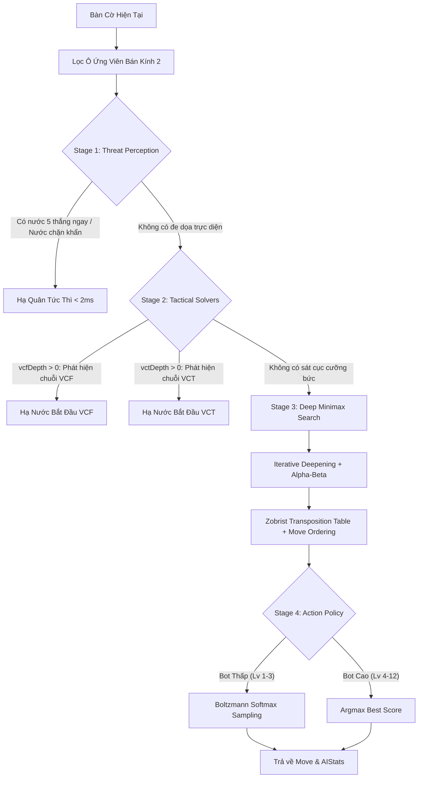

# 🧠 Hướng Dẫn & Thiết Kế Động Cơ AI Engine (AI & Algorithms)

Tài liệu này mô tả chi tiết kiến trúc thuật toán, pipeline ra quyết định (Decision Pipeline), các bộ giải chiến thuật chuyên sâu (VCF & VCT Solvers) và hệ thống bảng băm hoán vị (Zobrist Transposition Table) của AI trong **GoMockU**.

---

## 1. Kiến Trúc Pipeline Ra Quyết Định (Decision Pipeline)

Mỗi khi đến lượt Bot đi, [`AIEngine`](../src/game/aiEngine.ts) thực thi quy trình 4 tầng xử lý tuần tự:

---

## 2. Bốn Tầng Xử Lý Chi Tiết (The 4 Stages)

### 2.1. Stage 1: Nhận Thức Đe Dọa Tức Thời (Threat Perception)
* Kiểm tra xem AI có nước cờ tạo chuỗi 5 quân liên tiếp (`SCORES.FIVE`) để kết thúc ván đấu ngay lập tức.
* Kiểm tra xem Đối thủ có nước cờ tạo chuỗi 5 quân không để kích hoạt nước chặn khẩn cấp.
* **Chỉ số `threatVision` (0.0 - 1.0)**: Xác định xác suất AI nhận biết đe dọa của đối thủ (ở cấp thấp, Bot có thể "hoa mắt" bỏ sót nước 4 của người chơi, tạo cơ hội cho tân thủ).

### 2.2. Stage 2: Bộ Giải Sát Cục Chiến Thuật (VCF & VCT Solvers)
* **VCF Solver ([`vcf.ts`](../src/game/vcf.ts))**: *Victory by Continuous Fours* — Tìm kiếm nhánh cây cưỡng bức nơi AI liên tục đánh các nước 4 (ép đối phương chỉ có 1 nước đỡ duy nhất ở mỗi nhịp) cho đến khi đạt 5 quân.
* **VCT Solver ([`vct.ts`](../src/game/vct.ts))**: *Victory by Continuous Threats* — Tìm kiếm chuỗi đòn phối hợp gồm nước 3 mở (Open 3) và nước 4 dẫn tới Bẫy Đôi 4-3 hoặc Song Tam 3-3 không thể hóa giải.

### 2.3. Stage 3: Tìm Kiếm Cắt Tỉa Alpha-Beta & Bảng Băm Zobrist
* **Minimax với Alpha-Beta Pruning**: Giảm thiểu không gian tìm kiếm từ $O(b^d)$ xuống $O(b^{d/2})$ trong trường hợp lý tưởng.
* **Sắp Xếp Nước Đi (Move Ordering)**: Chấm điểm sơ bộ các ô ứng viên qua Heuristic Evaluation Matrix trước khi đi sâu vào cây tìm kiếm, tối đa hóa số lần cắt tỉa nhánh (Beta-cutoff).
* **Zobrist Transposition Table ([`zobrist.ts`](../src/game/zobrist.ts))**:
  * Mỗi vị trí ô cờ và màu quân được ánh xạ vào một số nguyên ngẫu nhiên 32-bit (`zobristTable[15][15][2]`).
  * Khóa băm của bàn cờ được cập nhật bằng phép toán bitwise `XOR` nhanh gọn ($O(1)$) khi đặt hoặc nhấc quân cờ.
  * Lưu trữ điểm số đánh giá, độ sâu duyệt và cờ Flag (`EXACT`, `LOWERBOUND`, `UPPERBOUND`) trên bảng băm 150,000 mục.

### 2.4. Stage 4: Chính Sách Ra Quyết Định (Action Policy)
* **Cấp cao (Level 4 - 12)**: Luôn chọn nước cờ có điểm số cao nhất tuyệt đối ($\arg\max$).
* **Cấp thấp (Level 1 - 3)**: Áp dụng phân phối xác suất Boltzmann Softmax:
  $$P(\text{move}_i) = \frac{e^{S_i / T}}{\sum_j e^{S_j / T}}$$
  Trong đó nhiệt độ $T$ (Temperature) điều khiển mức độ ngẫu nhiên, giúp Bot cấp thấp có lối chơi tự nhiên, đôi lúc đi nước ngây ngô phù hợp với người mới học chơi.

---

## 3. Bảng Điểm Đánh Giá Mẫu Hình Chiến Thuật (Heuristic Scoring)

Bảng điểm chuẩn được định nghĩa tại [`src/game/constants.ts`](../src/game/constants.ts):

| Hình Thái Chiến Thuật | Điểm Số Tương Đối (`Score`) | Ý Nghĩa Chiến Lược |
| :--- | :---: | :--- |
| **FIVE** (5 Quân) | `10,000,000` | Thắng trận tuyệt đối |
| **OPEN_FOUR** (4 Mở 2 đầu) | `1,000,000` | Chắc chắn thắng ở nước kế tiếp |
| **FOUR** (4 Bị chặn 1 đầu) | `100,000` | Ép đối phương phải đỡ ngay |
| **OPEN_THREE** (3 Mở 2 đầu) | `10,000` | Tiềm năng tạo 4 mở không thể cản |
| **BROKEN_THREE** (3 Nhảy cóc) | `8,000` | Đòn ngầm đánh lừa mắt đối thủ |
| **THREE** (3 Bị chặn 1 đầu) | `1,000` | Duy trì quyền tiên thủ |
| **OPEN_TWO** (2 Mở 2 đầu) | `100` | Hạt giống mở rộng thế trận |
| **CENTER_BONUS** (Ưu tiên tâm) | `10 - 20` | Giữ cự ly gần trung tâm bàn cờ |

---

## 4. Tối Ưu Hóa Hiệu Năng & Trải Nghiệm Mượt Mà

* **Thread Web Worker ([`src/workers/ai.worker.ts`](../src/workers/ai.worker.ts))**: Tính toán trên luồng nền độc lập, không gây giật lag khung hình UI.
* **Ngưỡng Giới Hạn Thời Gian (`timeLimitMs = 2500`)**: Ngăn chặn tình trạng tính toán quá lâu khi bàn cờ quá phức tạp, đảm bảo Bot phản hồi trong vòng dưới 2.5 giây.
