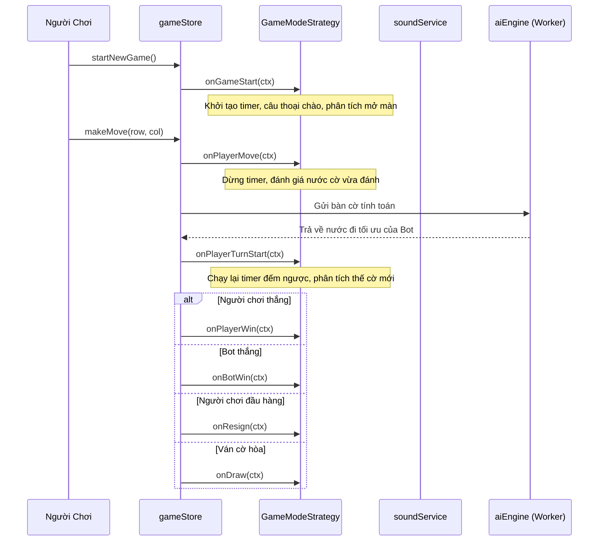

# 🏗️ Kiến Trúc Hệ Thống & Game Strategy Pattern (Software Architecture)

Tài liệu này mô tả chi tiết kiến trúc phần mềm, các mẫu thiết kế (Design Patterns), cơ chế quản lý trạng thái phản ứng (Reactive State Management) và luồng dữ liệu của ứng dụng **GoMockU**.

---

## 1. Tổng Quan Kiến Trúc (Architecture Overview)

GoMockU được xây dựng trên nền tảng **SolidJS** với cơ chế Fine-Grained Reactivity (phản ứng hạt mịn), kết hợp kiến trúc **Strategy Pattern** và **Modular Store Slices** để phân tách triệt để logic giữa các chế độ chơi, động cơ AI và giao diện người dùng:

```
┌─────────────────────────────────────────────────────────────────────────────────┐
│                                GIAO DIỆN NGƯỜI DÙNG                             │
│       GameBoard │ BotCharacter │ TutorCompanion │ GuideMasterView │ Modals       │
└────────────────────────────────────────┬────────────────────────────────────────┘
                                         │ Reactive Signals
┌────────────────────────────────────────▼────────────────────────────────────────┐
│                        TẦNG ĐIỀU PHỐI TRẠNG THÁI (STORE)                        │
│                         gameStore (Root Context & Facade)                       │
│  ┌──────────┬───────────┬───────────┬──────────┬──────────┬──────────┬───────────┤
│  │ aiSlice  │blitzSlice │guideSlice │puzzleSlic│seriesSlic│tauntSlice│ tutorSlice│
│  └──────────┴───────────┴───────────┴──────────┴──────────┴──────────┴───────────┤
└────────────────────────────────────────┬────────────────────────────────────────┘
                                         │ Strategy Polymorphism
┌────────────────────────────────────────▼────────────────────────────────────────┐
│                      TẦNG CHIẾN LƯỢC CHẾ ĐỘ CHƠI (STRATEGY)                     │
│                        getGameStrategy(mode) Factory                            │
│  ┌───────────────┬──────────────┬──────────────┬─────────────┬────────────────┐ │
│  │CampaignStrateg│ CustomStrateg│ BlitzStrategy│ TutorStrateg│  GuideStrategy │ │
│  │PuzzleStrategy │              │              │             │                │ │
│  └───────────────┴──────────────┴──────────────┴─────────────┴────────────────┘ │
└────────────────────────────────────────┬────────────────────────────────────────┘
                                         │ Web Worker / Async Pipeline
┌────────────────────────────────────────▼────────────────────────────────────────┐
│                        TẦNG DỊCH VỤ & ĐỘNG CƠ CỐT LÕI                           │
│  ┌───────────────────────┬──────────────────────────┬────────────────────────┐  │
│  │ aiEngine & Solvers    │ soundService (Web Audio) │ storageService (Persist│  │
│  │ (VCF/VCT/Alpha-Beta)  │ tauntEvaluator & Service │ guideEngine (Radar)    │  │
│  └───────────────────────┴──────────────────────────┴────────────────────────┘  │
└─────────────────────────────────────────────────────────────────────────────────┘
```

---

## 2. Strategy Pattern & Hệ Thống Vòng Đời (Lifecycle Hooks)

Mọi chế độ chơi trong GoMockU đều triển khai giao diện chuẩn [`GameModeStrategy`](../src/game/strategies/types.ts) kế thừa từ lớp cơ sở [`BaseStrategy`](../src/game/strategies/BaseStrategy.ts).

### 2.1. Danh Sách Các Chiến Lược (Strategies)

1. **`CampaignStrategy`**: Chế độ Chiến Dịch leo Thập Nhị Tông Sư (12 cấp độ Bot). Tự động thăng cấp khi thắng, luân phiên đổi phe Đen/Trắng.
2. **`CustomStrategy`**: Chế độ Tự Chọn đối thủ (1 - 12), tùy chọn phe quân, ghi nhận bảng thành tích riêng theo từng bot.
3. **`BlitzStrategy`**: Chế độ Cờ Chớp Sinh Tử (5s/10s/15s). Cấm Undo, kiểm soát đồng hồ đếm ngược, reset chuỗi khi thua hoặc hết giờ.
4. **`TutorStrategy`**: Chế độ Học Viện Gia Sư Gomo. Tích hợp phân tích nước đi trước khi đánh, phản hồi sau nước đi, báo cáo sau trận đấu.
5. **`PuzzleStrategy`**: Chế độ Giải Đố Thế Cờ. Tải thế cờ từ kho hạt giống hoặc sinh tự động (1⭐ đến 7⭐), kiểm duyệt nước giải sát cục.
6. **`GuideStrategy`**: Chế độ Nhập Môn & Thao Dượt. Tương tác với giáo trình 9 chương và bàn cờ Sandbox với Radar chiến thuật.

### 2.2. Vòng Đời Trận Đấu (Lifecycle Hooks)

Khi trận đấu diễn ra, `gameStore` sẽ tự động kích hoạt các hook tương ứng trên Strategy hiện tại:



---

## 3. Kiến Trúc Modular Store Slices

Để tránh biến file Store thành một khối khổng lồ nguyên khối (Monolith), trạng thái ứng dụng được chia thành 8 Slices độc lập đặt tại [`src/store/slices/`](../src/store/slices):

| Tên Slice | Vai Trò & Trách Nhiệm |
| :--- | :--- |
| **`aiSlice.ts`** | Quản lý trạng thái AI đang suy nghĩ, tiến trình duyệt cây (`depth`, `nodes`), hủy Worker. |
| **`blitzSlice.ts`** | Quản lý đồng hồ đếm ngược Cờ Chớp (5s/10s/15s), cờ báo Cháy Giờ (Timeout). |
| **`guideSlice.ts`** | Lưu tiến độ học 9 chương, bước bài học hiện tại, trạng thái Radar và các nhánh "What-If" Sandbox. |
| **`puzzleSlice.ts`** | Quản lý thế cờ giải đố hiện tại, độ khó sao (1⭐-7⭐), kiểm tra nước giải đúng/sai. |
| **`seriesSlice.ts`** | Quản lý chuỗi trận đấu nhiều ván (Series Match), luân phiên đổi màu quân Đen/Trắng. |
| **`settingsSlice.ts`** | Tùy chọn cài đặt người dùng: Bật/tắt âm thanh, số thứ tự nước đi, gợi ý nước đi, chủ đề giao diện. |
| **`tauntSlice.ts`** | Hàng đợi câu thoại cà khịa (Taunts Queue), đếm thời gian người chơi AFK, câu thoại hoạt họa. |
| **`tutorSlice.ts`** | Quản lý lời thoại của Gia sư Gomo, đánh giá tức thời chất lượng nước đi và báo cáo tổng kết. |

---

## 4. Kiến Trúc Đa Luồng Web Worker (AI Worker Threading)

Tính toán AI và giải chuỗi sát cục VCF/VCT là tác vụ tốn CPU nặng. Toàn bộ quá trình này được cô lập hoàn toàn trong Web Worker [`src/workers/ai.worker.ts`](../src/workers/ai.worker.ts):

1. **Giao tiếp qua Thông điệp Bất đồng bộ (Message Passing)**: Main UI Thread không bao giờ bị đơ (Zero Frame Drop), duy trì mượt mà 60 FPS.
2. **Cơ chế Hủy Tác Vụ Tức Thì (Cancellation Token)**: Khi người chơi bất ngờ bấm "Đầu Hàng", "Đi Lại" hoặc "Ván Mới" trong lúc AI đang tính toán sâu (Level 9-12), Main Thread lập tức gửi cờ hủy bỏ và khởi động lại Worker nếu cần.
3. **Báo cáo Tiến Độ Duyệt Cây (Search Progress Streaming)**: Worker định kỳ gửi thông tin độ sâu (`depth`) và số lượng node đã duyệt (`nodes`) về UI để hiển thị thanh trạng thái sống động.

---

## 5. Hệ Thống Âm Thanh Sóng Thuần (Web Audio API Synthesizer)

File [`src/services/soundService.ts`](../src/services/soundService.ts) sử dụng trực tiếp **Web Audio API** của trình duyệt để tổng hợp sóng âm thanh (Sine, Triangle, Sawtooth wave) kèm Envelope ADSR:
* **Không phụ thuộc file mp3/wav ngoài**: Giảm tải kích thước bundle, tải trang tức thì.
* **Đa dạng hiệu ứng**: Nước cờ nhẹ nhàng, ăn quân giòn giã, chuông đếm ngược hồi hộp (Blitz countdown tick), nhạc hiệu thăng cấp, chuông thoại Gia sư.
* **Tự động thích ứng**: Hỗ trợ Resume AudioContext khi người dùng có tương tác chạm đầu tiên trên thiết bị di động.
