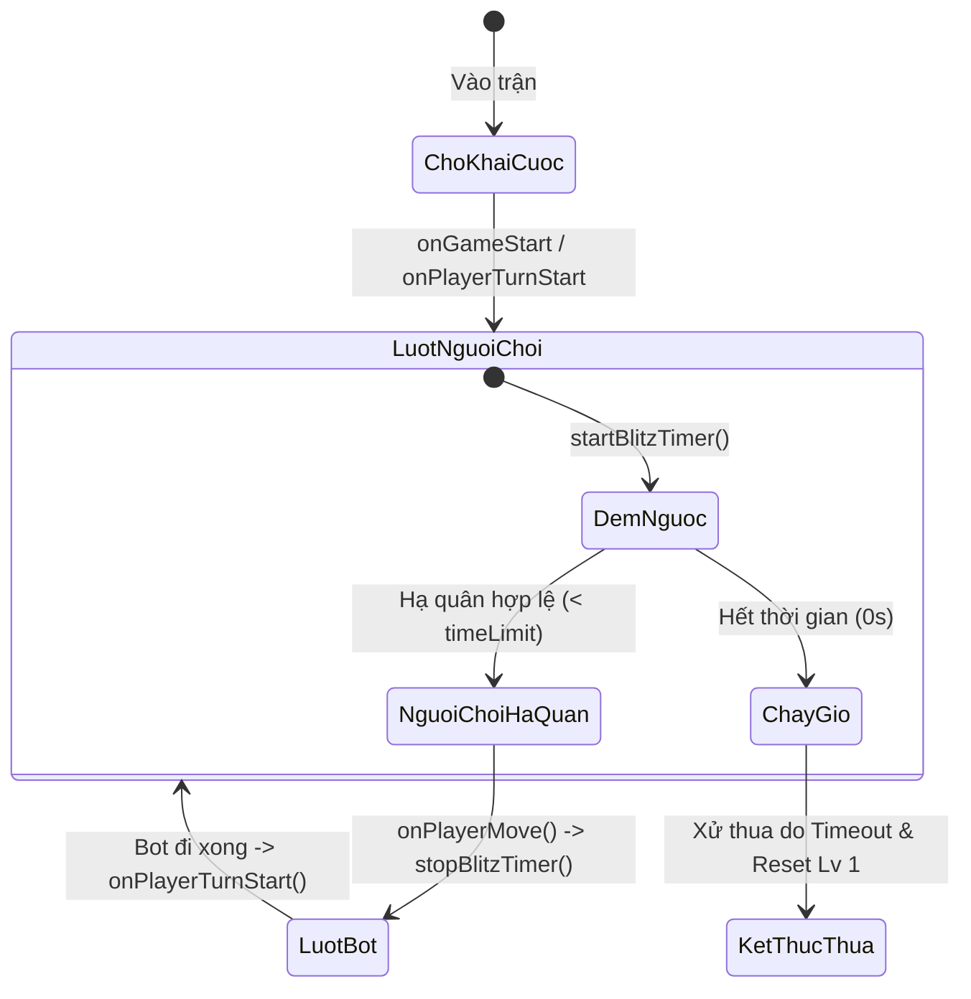

# ⚡ Hướng Dẫn & Thiết Kế Chế Độ Cờ Chớp Sinh Tử (Blitz Mode)

Tài liệu này mô tả chi tiết luật chơi, cơ chế đếm giờ, chu kỳ sinh tử và hệ thống vòng đời của **Chế độ Cờ Chớp Sinh Tử (Blitz Mode)** trong GoMockU.

---

## 1. Tầm Nhìn & Triết Lý Chế Độ Cờ Chớp

Cờ Chớp Sinh Tử được thiết kế nhằm mang lại trải nghiệm kịch tính, nhịp độ dồn dập và thử thách phản xạ chiến thuật đỉnh cao của kỳ thủ:
1. **Áp lực thời gian khắc nghiệt**: Mỗi nước đi chỉ có **5 giây**, **10 giây** hoặc **15 giây** để suy nghĩ và hạ cờ.
2. **Luật Sinh Tử (Sudden Death Progression)**:
   * Thắng một ván $\rightarrow$ Lập tức tiến lên đối đầu Bot cấp cao hơn (Lv 1 $\rightarrow$ Lv 12).
   * Thua bất kỳ ván nào (bị đối thủ đánh bại hoặc cháy giờ) $\rightarrow$ **Chuỗi sinh tử kết thúc ngay lập tức và đưa cấp độ về lại Cấp 1!**
3. **Cấm Tuyệt Đối Hoàn Tác (No Undo)**: Trong chế độ Cờ Chớp, tính năng Đi Lại (Undo) bị vô hiệu hóa hoàn toàn (`canUndo() === false`).

---

## 2. Các Tùy Chọn Thời Gian (Time Controls)

Người chơi có thể tùy biến 3 mốc thời gian ngay trước hoặc trong màn hình thi đấu:

| Mốc Thời Gian | Biểu Tượng | Đánh Giá Độ Khó | Đối Tượng Phù Hợp |
| :---: | :---: | :--- | :--- |
| **5 Giây** | ⚡⚡⚡ | **Cực Khắc Nghiệt** | Thách thức trực giác và phản xạ vô điều kiện của kiện tướng. |
| **10 Giây** | ⚡⚡ | **Chuẩn Mực (Default)** | Cân bằng giữa tốc độ quan sát đe dọa và ra quyết định. |
| **15 Giây** | ⚡ | **Dễ Thở** | Phù hợp để làm quen với nhịp cờ nhanh và tính toán đòn bẫy 4-3. |

---

## 3. Cơ Chế Đếm Giờ & Xử Lý Cháy Giờ (Timer Lifecycle)

Đồng hồ đếm ngược được quản lý tự động thông qua Lifecycle Hooks của [`BlitzStrategy`](../src/game/strategies/BlitzStrategy.ts):

### 3.1. Âm Thanh Hồi Hộp (Ticking Sound)
Khi thời gian còn lại dưới **3 giây**, hệ thống tự động kích hoạt hiệu ứng âm thanh tích tắc dồn dập (Synthesized Ticking Chime) qua `soundService` để cảnh báo người chơi.

### 3.2. Xử Lý Cháy Giờ (Timeout Event)
Khi đồng hồ về 0:
1. `blitzSlice` kích hoạt cờ `isBlitzTimeout = true`.
2. Trận đấu lập tức kết thúc với kết quả Người chơi Thua.
3. Bot kích hoạt câu thoại cà khịa đặc thù cho sự kiện cháy giờ (ví dụ: *"Hết giờ rồi bạn ơi, nhìn bàn cờ ngắm cảnh à?"*).
4. Cập nhật chỉ số `stats.blitz.timeoutLosses`.

---

## 4. Bảng Chỉ Số Thống Kê (Blitz Stats)

Tiến trình chơi Cờ Chớp được lưu trữ độc lập trong `UserStats.blitz`:
* `currentLevel`: Cấp độ hiện tại trong chuỗi sinh tử đang leo (1 đến 12).
* `highestLevel`: Kỷ lục cấp độ cao nhất từng chinh phục thành công.
* `currentStreak`: Chuỗi trận thắng liên tiếp hiện tại.
* `bestStreak`: Kỷ lục chuỗi thắng cờ chớp dài nhất.
* `totalWins` / `totalLosses` / `totalGames`: Tổng số trận thắng/thua/tham gia.
* `timeoutLosses`: Số lần thất bại do cháy giờ.
* `selectedTimeSeconds`: Mốc thời gian ưu tiên của người chơi (5s / 10s / 15s).
