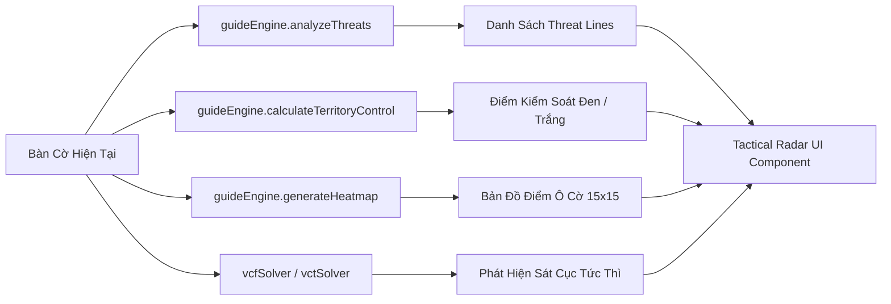

# 🎓 Tài Liệu Thiết Kế & Hướng Dẫn Hệ Thống Master Guide & Sandbox Mode

Tài liệu này mô tả toàn diện kiến trúc, phương pháp sư phạm, cơ chế phân tích chiến thuật thời gian thực và cấu trúc dữ liệu của **Chế độ Học Cờ Tương Tác (Master Guide)** và **Bàn Cờ Thao Dượt Tự Do (Sandbox Mode)** trong GoMockU.

---

## 1. Tầm Nhìn & Triết Lý Thiết Kế (Vision & Pedagogy)

Chế độ Nhập Môn & Thao Dượt được xây dựng dựa trên triết lý **"Học Đi Đôi Với Hành — Tương Tác Trực Quan Không Cuộn Trang" (Zero-Scroll Interactive Learning)**:
1. **Lộ trình bài bản chuẩn quốc tế**: Từ cự ly cơ bản, hình thái nước 2/3/4 đến 26 thế khai cuộc Renju, đòn bẫy kép 4-3, chuỗi sát cục VCF/VCT và phân tích toàn cục 14 đại kỳ phổ mẫu.
2. **Thao tác 1-chạm & Gợi ý phân nhánh (Branching Hints)**: Người chơi trực tiếp hạ quân trên bàn cờ. Mỗi nước đi đều nhận phản hồi tức thì (Best / Good / Acceptable / Passive / Blunder) kèm nước đi đối phó mô phỏng của đối thủ.
3. **Radar Chiến Thuật & Bản Đồ Nhiệt (Tactical Radar & Heatmap)**: Trực quan hóa quyền kiểm soát không gian, các trục đe dọa (Threat Lines) và chấm điểm từng giao điểm cờ.
4. **Thao dượt giả định "What-If"**: Cho phép người chơi tự do thử nghiệm các biến thể nước đi trên bàn cờ Sandbox mà không làm xáo trộn thế trận gốc.

---

## 2. Cấu Trúc Giáo Trình Master Guide (9 Chương & 42 Bài Học)

Hệ thống bài học được định nghĩa chi tiết tại [`src/data/guide/lessons.ts`](../src/data/guide/lessons.ts) với 9 chương chuyên đề:

```
┌──────────────────────────────────────────────────────────────────────────────────┐
│                                GIÁO TRÌNH GOMOCKU                                │
├───────────┬─────────────────────────────────────────────────┬────────────────────┤
│ Chương    │ Tên Chuyên Đề                                   │ Số lượng bài học   │
├───────────┼─────────────────────────────────────────────────┼────────────────────┤
│ Chương 1  │ Khởi Đầu & Nước Cờ Đầu Tiên (Nền Tảng)          │ 3 bài học          │
│ Chương 2  │ Nhận Diện Hình Thái Đe Dọa (Chiến Thuật Cơ Bản) │ 5 bài học          │
│ Chương 3  │ Khai Cuộc Kinh Điển (26 Renju Openings)         │ 4 bài học          │
│ Chương 4  │ Nghệ Thuật Tư Duy & Đòn Bẫy Kép (Forks)         │ 5 bài học          │
│ Chương 5  │ Quản Lý Nhịp Độ & Nước Chờ (Tempo & Quiet Moves)│ 3 bài học          │
│ Chương 6  │ Chuỗi Sát Cục Tuyệt Đỉnh (VCF & VCT Masterclass)│ 3 bài học          │
│ Chương 7  │ Nghệ Thuật Phòng Thủ & Phản Kích (Defense)      │ 3 bài học          │
│ Chương 8  │ Chuyên Đề Luật Cấm Renju & Bẫy Cấm (Foul Trap)  │ 2 bài học          │
│ Chương 9  │ Phân Tích Toàn Cảnh Ván Đấu Mẫu (Đại Kỳ Phổ)    │ 14 kỳ phổ mẫu      │
├───────────┴─────────────────────────────────────────────────┴────────────────────┤
│ TỔNG CỘNG: 9 CHƯƠNG — 42 BÀI HỌC VÀ KỲ PHỔ PHÂN TÍCH CHUYÊN SÂU                  │
└──────────────────────────────────────────────────────────────────────────────────┘
```

### 2.1. Chi Tiết Nội Dung Từng Chương

* **Chương 1: Khởi Đầu & Nước Cờ Đầu Tiên**
  * `lesson_1_1`: *Tâm Bàn Cờ (Tengen - H8)* — Tối ưu hóa 8 hướng kiểm soát từ tọa độ trung tâm.
  * `lesson_1_2`: *Nước Thứ 2 Của Trắng (Trực Tiếp vs Gián Tiếp)* — Khai cuộc áp sát trực diện hoặc chặn chéo.
  * `lesson_1_3`: *Cự Ly & Sự Liên Kết (Connectivity)* — Khoảng cách 1-2 ô và cạm bẫy khi đánh quân rời rạc.

* **Chương 2: Nhận Diện Hình Thái Đe Dọa**
  * `lesson_2_1`: *Hình Thái Nước 2 Tiềm Năng (Live Two)* — 2 quân liền và 2 quân nhảy cóc.
  * `lesson_2_2`: *Nước 3 Mở (Live Three / Open Three)* — Đòn ép buộc đối phương phải đỡ ngay lập tức.
  * `lesson_2_3`: *Nước 3 Bị Chặn (Sleeping Three / Dead Three)* — Tận dụng nước 3 nửa mở để cướp nhịp.
  * `lesson_2_4`: *Nước 4 Mở (Live Four) vs Nước 4 Bị Chặn* — Chốt hạ thắng lợi không thể cản phá.
  * `lesson_2_5`: *Nước 3 Nhảy Cóc (Jump Three)* — Các biến thể `X.XX` và `XX.X` đánh lừa mắt đối thủ.

* **Chương 3: Khai Cuộc Kinh Điển (26 Renju Openings)**
  * `lesson_3_1`: *Thế Hoa Nguyệt (Huayue)* — Khai cuộc trực tiếp mạnh nhất của Đen.
  * `lesson_3_2`: *Thế Phố Nguyệt (Puyue) & Vũ Nguyệt (Yuyue)* — Cánh bướm và đâm thẳng trục giữa.
  * `lesson_3_3`: *Thế Khâu Nguyệt (Qiuyue)* — Khai cuộc gián tiếp linh hoạt, phòng thủ phản công.
  * `lesson_3_4`: *Chiến Lược Khai Cuộc Cho Quân Trắng* — Kỹ thuật hóa giải sức ép Tiên thủ của Đen.

* **Chương 4: Nghệ Thuật Tư Duy & Đòn Bẫy Kép (Forks & Combinations)**
  * `lesson_4_1`: *Quy Trình 4 Bước Tư Duy*: Quan sát đe dọa $\rightarrow$ Tìm nước tấn công $\rightarrow$ Kiểm tra đòn bẫy $\rightarrow$ Đặt quân.
  * `lesson_4_2`: *Đòn Bẫy Kép 4-3 (Four-Three Fork)* — Tuyệt chiêu chuẩn mực định đoạt ván cờ.
  * `lesson_4_3`: *Đòn Kép 3-3 (Double Three Fork)* — Đòn song tam tấn công 2 hướng.
  * `lesson_4_4`: *Đòn Bẫy Kép 4-4 (Double Four Fork)* — Ép chặn 1 hướng để thắng ở hướng còn lại.
  * `lesson_4_5`: *Đòn Chéo Xiên & Bẫy Chữ Thập (Diagonal Pinning)* — Khóa trục giao cắt.

* **Chương 5: Quản Lý Nhịp Độ & Nước Chờ (Tempo & Quiet Moves)**
  * `lesson_5_1`: *Quyền Chủ Động (Sente vs Gote)* — Phân biệt thế cờ nắm Tiên thủ và bị động chống đỡ.
  * `lesson_5_2`: *Nghệ Thuật "Nước Chờ" (Quiet Move / Waiting Move)* — Tích lũy tiềm lực không để lộ ý đồ.
  * `lesson_5_3`: *Kỹ Thuật Đóng Băng & Giới Hạn Không Gian* — Bóp nghẹt hướng mở rộng của đối thủ.

* **Chương 6: Chuỗi Sát Cục Tuyệt Đỉnh (VCF & VCT Masterclass)**
  * `lesson_6_1`: *Sát Cục VCF (Victory of Continuous Fours)* — Chuỗi ép nước 4 liên tục không cho đối thủ thở.
  * `lesson_6_2`: *Đòn Ép VCT (Victory of Continuous Threats)* — Chuỗi kết hợp nước 3 mở và nước 4.
  * `lesson_6_3`: *Phối Hợp Đan Xen VCF và VCT* — Chuyển hóa linh hoạt giữa ép 3 và ép 4.

* **Chương 7: Nghệ Thuật Phòng Thủ & Phản Kích (Master Defense)**
  * `lesson_7_1`: *Nước Chặn "1 Hóa Giải 2" (Dual Blocking)* — 1 quân chặn đồng thời 2 đường công.
  * `lesson_7_2`: *Chặn Kèm Phản Công (Block & Counter-Threat)* — Biến nước đỡ thành đe dọa mở 3/4.
  * `lesson_7_3`: *Bẻ Gãy Chuỗi Sát Cục* — Phá mắt xích liên kết then chốt của đối phương.

* **Chương 8: Chuyên Đề Luật Cấm Renju & Bẫy Cấm (Renju Fouls)**
  * `lesson_8_1`: *Nhận Diện 3 Luật Cấm Của Đen*: Cấm Nước 3-3 Đôi, Cấm Nước 4-4 Đôi, Cấm Trường Liên (> 5 quân).
  * `lesson_8_2`: *Nghệ Thuật Bẫy Cấm (Foul Trap)* — Quân Trắng ép quân Đen tự đánh vào ô phạm quy.

* **Chương 9: Phân Tích Toàn Cảnh Ván Đấu Mẫu (14 Đại Kỳ Phổ)**
  * `lesson_9_1` đến `lesson_9_14`: Toàn văn 14 ván đấu mẫu kinh điển phân tích từng bước từ nước 1 đến nước thắng cuộc.

---

## 3. Kiến Trúc Động Cơ Guide Engine & Sandbox Mode

Động cơ phân tích [`src/game/guideEngine.ts`](../src/game/guideEngine.ts) cung cấp các thuật toán phân tích bàn cờ trong thời gian thực:



### 3.1. Phân Tích Đường Đe Dọa (Threat Detection)
* Duyệt qua 4 trục không gian: Ngang (`0, 1`), Dọc (`1, 0`), Chéo xuôi (`1, 1`), Chéo ngược (`1, -1`).
* Nhận diện các hình thái:
  * `FIVE`: 5 quân liên tiếp (Thắng trận).
  * `OPEN_FOUR`: 4 quân mở 2 đầu (Đòn tất thắng).
  * `FOUR`: 4 quân bị chặn 1 đầu (Ép đỡ).
  * `OPEN_THREE`: 3 quân mở 2 đầu (Đòn tấn công chủ động).
  * `THREE`: 3 quân bị chặn 1 đầu / Nhảy cóc.
  * `OPEN_TWO`: 2 quân mở tạo tiềm năng phát triển.

### 3.2. Bản Đồ Nhiệt & Điểm Kiểm Soát (Heatmap & Territory Score)
* Tính toán trọng số tiềm năng cho từng ô cờ trống:
  * Nước đi tạo sát cục VCF: Trọng số $+50,000$.
  * Nước đi tạo đòn ép VCT / Song 4: Trọng số $+20,000$.
  * Nước tạo Bẫy 4-3 / Song 3: Trọng số $+8,000$.
  * Nước mở 3: Trọng số $+1,500$.
  * Nước mở 2 trung tâm: Trọng số $+200$.
* Tỷ lệ kiểm soát lãnh thổ (Territory Percentage) dựa trên tổng điểm tiềm năng của Đen so với Trắng:
  $$\text{Black Control \%} = \frac{\text{Score}_{\text{Black}}}{\text{Score}_{\text{Black}} + \text{Score}_{\text{White}}} \times 100\%$$

### 3.3. Nhánh Thử Cờ Giả Định ("What-If" Exploration)
* Cho phép người chơi đặt liên tiếp các nước đi thử nghiệm của cả 2 bên.
* Hệ thống lưu trữ danh sách `WhatIfStep[]` gồm: số thứ tự nước đi, tọa độ `(row, col)`, phe đi quân và nhận xét chiến thuật tương ứng.
* Nút **"Khôi Phục Thế Trận Gốc" (Clear What-If)** lập tức đưa bàn cờ về trạng thái thiết lập ban đầu.

---

## 4. Kho Thế Cờ Mẫu Định Sẵn (Sandbox Presets)

Trong [`src/data/guide/presets.ts`](../src/data/guide/presets.ts), hệ thống tích hợp sẵn các thế cờ mẫu để người chơi nạp nhanh vào bàn cờ thao dượt:
1. **Khai cuộc Trực tiếp Hoa Nguyệt (Huayue Direct)**
2. **Khai cuộc Gián tiếp Khâu Nguyệt (Qiuyue Indirect)**
3. **Thế cờ Bẫy Đôi 4-3 (Four-Three Tactical Fork)**
4. **Chuỗi Sát Cục 5 Nước VCF (VCF Continuous Attack)**
5. **Thế cờ Phòng Thủ Chặn Kèm Phản Công (Master Defense Counter)**

---

## 5. Quản Lý Tiến Độ & Lưu Trữ (Persistence)

Tiến trình học tập được quản lý bởi [`guideSlice.ts`](../src/store/slices/guideSlice.ts) và lưu tự động vào `localStorage` qua `storageService`:
* `completedLessons`: Danh sách mã ID bài học đã hoàn thành.
* `unlockedChapters`: Các chương đã mở khóa (vượt qua bài học sẽ tự động mở chương kế tiếp).
* `lastSelectedLessonId`: Lưu vị trí bài học đang học dở để người chơi tiếp tục học ngay khi quay lại.
